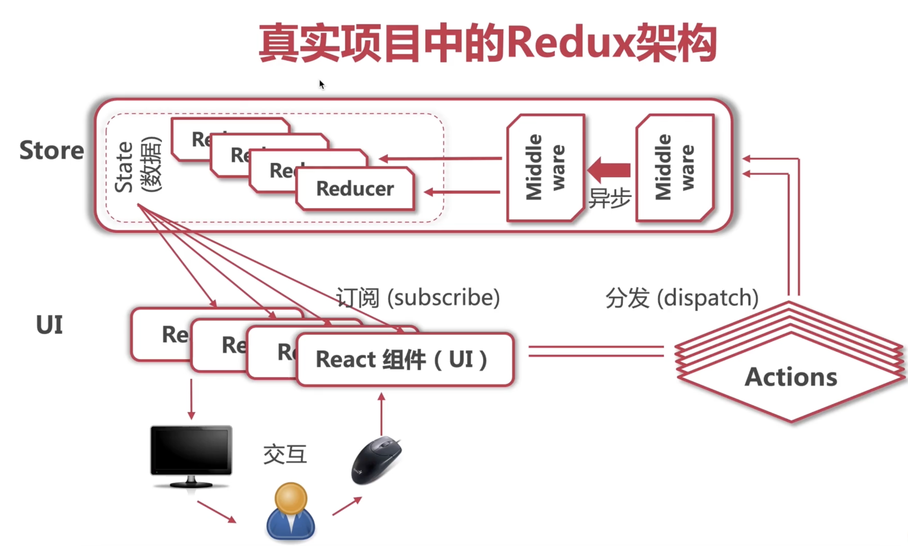
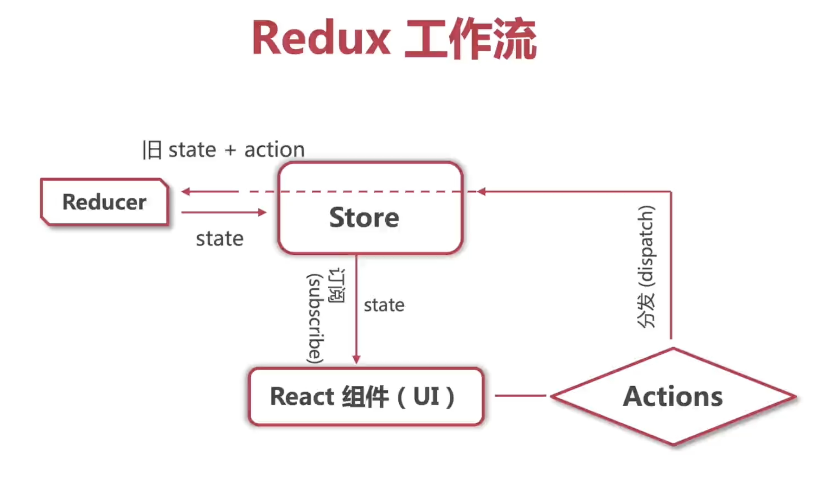
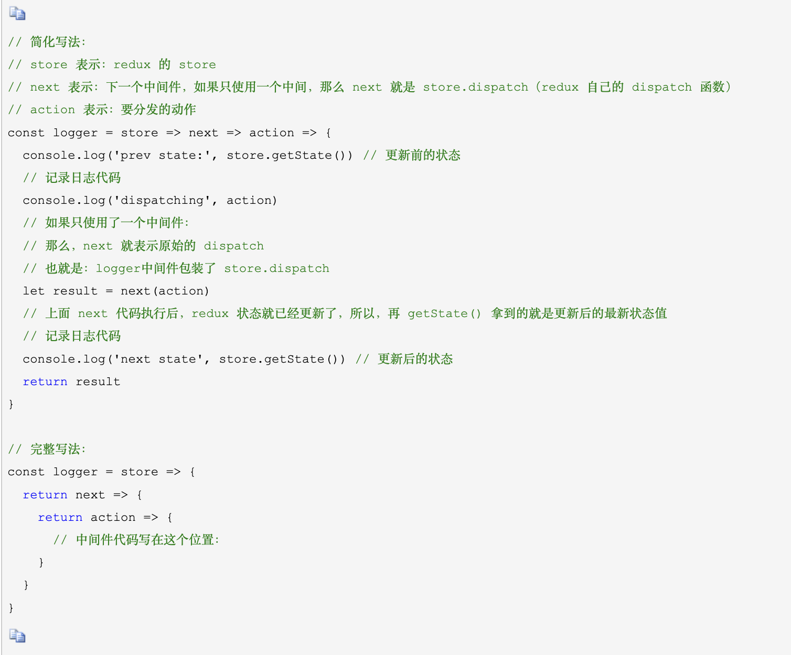

## 课程说明知识点

### 一、安装部分
1. 在初始化项目中
    ``` javascript
    npx create-react-app react-travel --template typescript
    ```
   生成的项目稳文件中会有.d.ts,这个文件是指 只包含类型信息的类型声明文件不会生成js文件，仅用于提供类型信息。

2. 在react项目中为了使用css模块化cssModule，采用插件typescript-plugin-css-modules. 
   步骤如下：
    ``` javascript
    npm install -D typescript-plugin-css-modules
    ```
    其次在tsconfig.json中配置
    ``` javascript
    
    "compilerOptions": {
        "plugins": [{"name": "typescript-plugin-css-modules"}]
        }
    
    ```
    最后在settings.json中配置
    在项目根目录下创建.vscode文件夹，在文件夹中新建settings.json并写入如下配置:
    ``` json
    "typescript.tsdk": "node_modules/typescript/lib",
    "typescript.enablePromptUseWorkspaceTsdk": true
    ```
    常见文件配置：
    css文件一般 x.module.css这种命名方式，比如App.css 改为app.module.css<br/>
    文件引入之后，采用如下引用方式

    ``` tsx
    import React from 'react';
    import logo from './logo.svg';
    import styles from './App.module.css'

    function App() {
    return (
        <div className={styles.App}>
        
        </div>
        );
    }

    ```
### 二、路由部分
``` tsx
    react-router v6版本全面倒向了函数式组件
```
1. react-router： 最主流最完整的React路由解决方案
   ``` tsx
    react-router-dom: 用于浏览器，处理web app路由
    react-router-native: 用于手机react-native 处理手机app路由
    react-router-redux： 提供了路由中间件，处理redux的集成
    react-router-config: 用来静态配置路由
   ```
2. ``` tsx 
    会自动安装react-router 核心框架
    <Link /> 组件可以渲染出<a /> 标签
    <BrowserRouter /> 可以利用H5 API 实现路由切换
    <HashRouter /> 组件利用原生js中的window.location.hash来实现路由切换
    ```
### 三、redux 和 react-redux 相关知识
``` tsx 
总结：redux只是一种架构模式，它可以应用到任意需要使用它的框架，目的就是为了解决复杂应用中不同组件之间共享状态而产生的。本质就是：数据仓库，在隔离了数据与UI的同时，负责处理数据的绑定；
    剥离组件数据
    数据统一存放在store中
    组件订阅store获得数据
    store同步推送数据更新
``` 
真实项目中的redux架构 <br><br>
<br>   
Redux简化工作流<br><br>
<br>
``` tsx
redux就是提供了一个叫store的容器，里边的state存放了全局的状态，对外提供了三种方法： getState(), dispatch(), subscribe()

getState(): 用来返回当前state的值.

dispatch(): 用来发起一个action，来告诉一个叫reducer的纯函数怎么去更新state,同时把上一次的state作为参数也传递给reducer,reducer拿到参数后，返回更新后的state,得到新的state后就需要渲染组件，可以通过手动调用render方法，但是比较麻烦。可以采用subscribe()函数重新渲染组件.

subscribe(): 订阅state的变化，当state变化的时候执行回调，可以有多个subscribe,里边的回调会依次执行.

```
<strong>React-redux 是Redux 的官方绑定库，它能够使你的react组件从Redux store中读取数据，并且向store 分发actions 从而更新数据。</strong><br>

#### 3.1 为什么需要react-redux <br/>
``` tsx 
React组件使用redux 需要引入store,并且要手动调用store.subscribe()监听store中的state变化，使用起来比较麻烦。而 react-redux简化了这些步骤。

react-redux 是运用Provider将组件和store对接，使在Provider里的所有组件都能共享store里的数据。

在容器组件中通过react-redux 核心API：connect来连接 UI组件和redux，connect 是一个高阶函数，第一个参数接收的是两个回调函数。

```
#### 3.2 react-redux 之useSelector、useDispatch用法<br/><br/>
``` tsx
react-redux从v7.1.0开始，支持hook Api并且暴露了useSelector以及useDispatch等hook.

useSelector 替代 mapStateToProps 从store中提取state数据
useDispatch 替代 mapDispatchToProps 从store中获取dispatch 方法的引用
```
#### 3.3 class类组件中如何使用react-redux中相关技术概念connect() mapStateToProps() mapDispatchToProps()等<br>
``` tsx
connect(): 方法用于从UI组件生成容器组件,意思就是将两种组件连接起来。

    import { connect } from 'react-redux'
    const visibleTodoList = connect()(TodoList)

上面代码中TodoList是 UI 组件，VisibleTodoList就是由 React-Redux 通过connect方法自动生成的容器组件。

但是因为没有定义业务逻辑，上面这个容器组件毫无意义，只是 UI 组件的一个单纯的包装层。为了定义业务逻辑，需要给出下面两方面的信息。

1. 输入逻辑：外部的数据（即state对象）如何转换为UI组件参数
2. 输出逻辑：用户发出的动作如何变为Action对象，从UI组件传出去

    import { connect } from 'react-redux'
    const visibleTodoList = connect(
        mapStateToProps,
        mapDispatchToProps
    )(TodoList)

    上面代码中，connect方法接受两个参数：mapStateToProps和mapDispatchToProps。他们定义了UI组件的业务逻辑。

    mapStateToProps(): 是一个函数，负责输入逻辑，将state映射到UI组件的参数props.建立一个从（外部的）state对象到（UI组件的）props对象的映射关系。

    作为函数，mapStateToProps执行后应该返回一个对象，里边的每一个键值对就是一个映射。

    const mapStateToProps = (state) => {
        return {
            todos: getVisibleTodos(state.todos, state.visibilityFilter)
        }
    }

    这段代码中mapStateToProps是一个函数，它接受state作为参数，返回一个对象。

    mapStateToProps会订阅 Store，每当state更新的时候，就会自动执行，重新计算 UI 组件的参数，从而触发 UI 组件的重新渲染。

    ======================================================

    mapDispatchToProps(): 负责输出逻辑，将用户对UI组件的操作映射成Action.也就是说，它定义了哪些用户的操作应该当作 Action，传给 Store。它可以是一个函数，也可以是一个对象。

    const mapDispatchToProps = (dispatch) => {
        return {
            fetchStart: () => {
                dispatch(fetchRecommendProductStartActionCreator())
            },
            fetchSuccess: (data) => {
                dispatch(fetchRecommendProductSuccessActionCreator(data))
            },
            fetchFail: (error) => {
                dispatch(fetchRecommendProductFailActionCreator(error))
            }
        }
    }

    mapDispatchToProps作为函数，应该返回一个对象，该对象的每个键值对都是一个映射，定义了 UI 组件的参数怎样发出 Action。

    如果mapDispatchToProps是一个对象，它的每个键名也是对应 UI 组件的同名参数，键值应该是一个函数，会被当作 Action creator ，返回的 Action 会由 Redux 自动发出。

```

#### 3.4 redux中间件概念
``` tsx 
概念：中间件可以理解为处理一个功能的中间环节。
     中间件的优势： 可以串联、组合，在一个项目中使用多个中间件
                 Redux 中间件用来处理 状态 更新，也就是说在 状态 更新的过程中，执行一系列相应的操作.

    总之： dispatch一个action之后，到达reducer之前，进行一些额外的操作，就需要用到middleware 来进行日志记录，创建崩溃报告，调用异步接口或者路由等。换句话说：中间件就是对store.dispatch()的增强。            
``` 
#### 3.5 redux中间件的使用
<br/>  

### 四、rudux-toolkit概念以及用法
#### 4.1 相关函数概念

<strong>createAsyncThunk函数</strong>

``` tsx

createAsyncThunk: 创建一个异步的thunk action，具体来说，createAsyncThunk接受两个参数，typePrefix 和 payloadCreator。

typePrefix: 是一个字符串，用于定义Thunk action类型前缀，payloadCreator:是一个异步函数，用于创建thunk的有效载荷，并返回一个promise对象.


export const getProductDetail = createAsyncThunk(
    "productDetail/getProductDetail",
    async (touristRouteId: string, thunkAPI) => {
        const { data } = await axios
                .get(`http://123.56.149.216:8080/api/touristRoutes/${touristRouteId}`)
        return data;        
    }
)

上面这段代码中，typePrefix 是 "productDetail/getProductDetail"。

它表示这个 Thunk action 的类型是 productDetail/getProductDetail/pending、productDetail/getProductDetail/fulfilled 和 productDetail/getProductDetail/rejected。这些类型分别表示 Thunk action 的开始、成功和失败三种状态。

而payloadCreator是一个异步函数，它接受一个名为 touristRouteId 的字符串参数和一个名为 thunkAPI 的对象参数。其中，touristRouteId 表示要获取的旅游路线id；thunkAPI 则是一个包含了一些有用方法和属性的对象，可以用于编写更加复杂的 Thunk action。

上面这段代码中，通过get请求发送id获取了指定旅游路线的详情，并将其存储在data变量中，最后函数返回了data对象，作为Thunk action 的有效负载,这个有效负载会在 Thunk action 被派发时传递给 reducer，并被用于更新 Redux store 中的状态.

```
<strong>createSlice函数</strong>
``` tsx
export const productDetailSlice = createSlice({
    name: 'productDetail',
    initialState,
    reducers: {
        
    },
    extraReducers: {
        [getProductDetail.pending.type]: (state) => {
            // return { ...state, loading: true }
            state.loading = true;
        },
        [getProductDetail.fulfilled.type]: (state, action) => {
            state.data = action.payload;
            state.loading = false;
            state.error = null;
        },
        [getProductDetail.rejected.type]: (state, action: PayloadAction<string | null>) => {
            state.loading = false;
            state.error = action.payload;
        }
    }
})

'createSlice' 函数用于创建一个 Redux reducer 和对应的 action creators。它接受一个包含了 name、initialState、reducers 和 extraReducers 四个属性的配置对象作为参数.

reducers 属性是一个对象，用于定义一组同步的 reducer 函数，它们会被自动转换成相应的 action creators.

extraReducers 属性则是一个对象，用于定义一组异步的 reducer 函数，它们会被自动转换成相应的 Thunk action creators.

上面的例子中，由于 reducers 属性是一个空对象，因此没有定义任何同步的 reducer 函数和对应的 action creators。而 extraReducers 属性则是一个包含了三个 reducer 函数的对象，它们分别对应了 getProductDetail 异步 Thunk action 的开始、成功和失败三种状态。

总之:
reducers 和 extraReducers 都是用于定义 reducer 函数和对应的 action creators 的属性。它们的区别在于 reducers 用于定义同步的 reducer 函数和对应的 action creators，而 extraReducers 用于定义异步的 reducer 函数和对应的 Thunk action creators。在使用 createSlice 函数时，我们可以根据需要选择使用其中的一个或者两个属性。

```

### 五、技术相关问题
1.  type 和 interface 区别<br/>
    ``` tsx 
    1.1 type后面有=, interface 没有;

        type ID = string | number;
        type Circle = {
            x: number;
            y: number;
            radius: number;
        }

        interface 用来代表一种类型组合，但是它的范围更小一些，只能描述对象结构

        interface Position {
            x: number;
            y: number;
        }
        
    1.2 多次声明的同名interface 会进行声明合并，type则不允许多次声明 
    
    1.3 interface 支持继承其他接口
        interface Shape {
            color: string;
        }
        interface Square extends Shape {
            sideLength: number;
        }
    ```
2. react中为了防止注入攻击，进行html渲染的时候需要特殊的语法格式。
   ``` tsx
     <div dangerouslySetInnerHTML={{ __html: product.notes }}
        style={{ margin: 50 }} >
     </div>

     上面中的dangerouslySetInnerHTML 属性就是防止注入攻击
   ```
         
